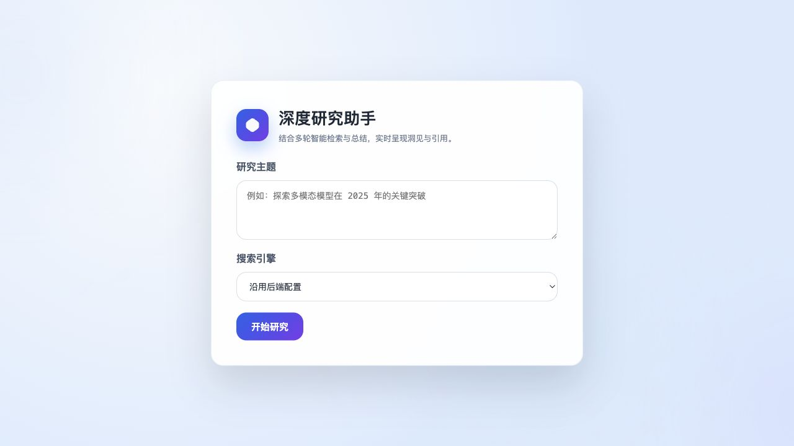
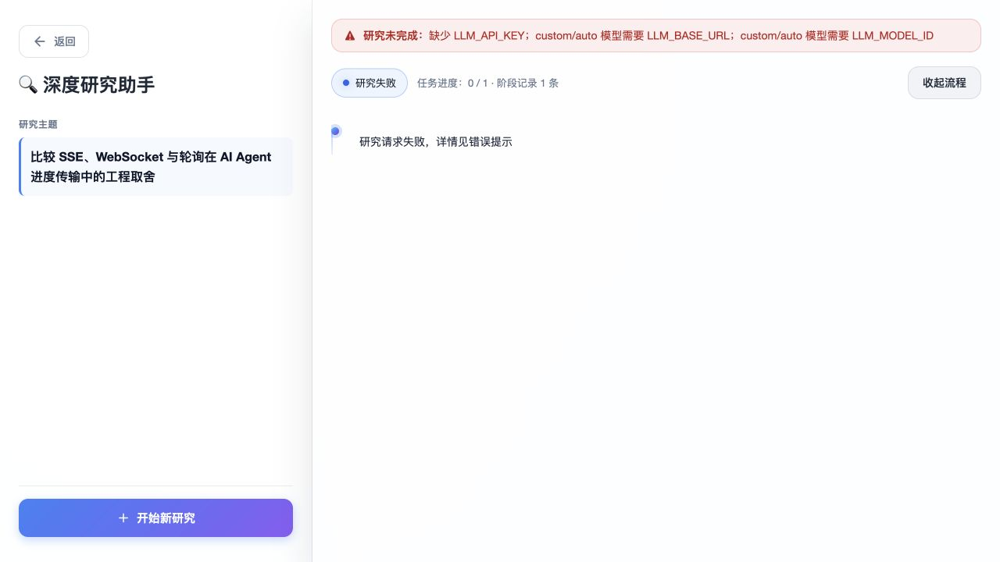
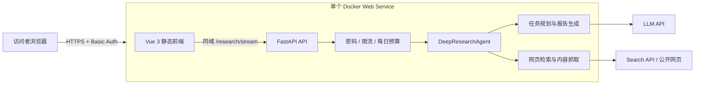
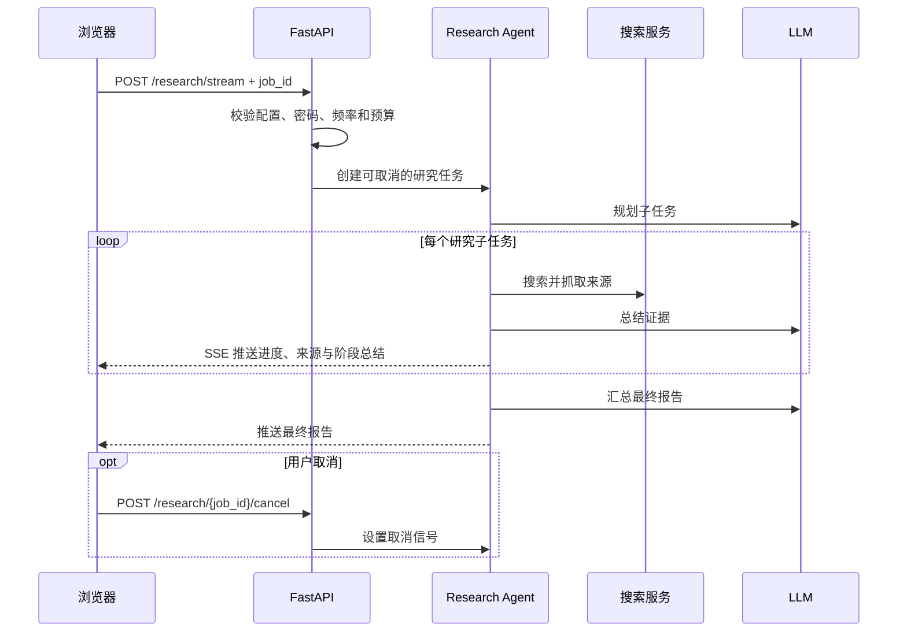

# Deep Research Agent

一个可公开演示的深度研究智能体：把研究主题拆成多个检索任务，持续展示搜索、总结和引用过程，最后生成结构化研究报告。

本项目基于 Datawhale [`hello-agents`](https://github.com/datawhalechina/hello-agents) 第十四章“自动化深度研究智能体”的代码整理，并在此基础上补充了单容器部署、运行保护、任务取消、错误反馈和工程化文档。来源与许可说明见 [ATTRIBUTION.md](./ATTRIBUTION.md)。



## 当前能力

- Vue 3 前端实时展示任务规划、检索来源、阶段总结和最终报告。
- FastAPI（Python Web 接口框架）通过 SSE（服务器持续向浏览器推送事件）返回研究进度。
- 支持 DuckDuckGo、Tavily、Perplexity、SearXNG 等检索来源。
- DuckDuckGo 直连受限或无结果时，自动切换到 DDGS 多引擎公共搜索。
- 支持 Ollama、LM Studio 和 OpenAI-compatible API（兼容 OpenAI 请求格式的模型服务）。
- 单个 Docker 容器同时承载前端和后端，浏览器只访问一个公开地址。
- 启动配置检查、基础访问密码、按 IP 限流、每日研究次数上限。
- 每个任务具有独立 `job_id`，失败会显示原因，运行中的任务可以取消。

配置不完整或第三方服务失败时，错误会保留在研究结果区，不再出现“页面切换后只有空白”的情况：



## 架构



当前版本没有数据库。运行状态、限流计数和取消信号保存在单个进程内存中，适合受控的作品集演示；容器重启后这些数据会清空。

## 一次研究的运行流程



## 本地运行

### Docker（推荐，最接近云端）

```bash
docker build -t deep-research-agent .
docker run --rm -p 8000:10000 \
  -e APP_ACCESS_PASSWORD='replace-with-a-strong-password' \
  -e LLM_PROVIDER='custom' \
  -e LLM_MODEL_ID='your-model-id' \
  -e LLM_BASE_URL='https://your-provider.example/v1' \
  -e LLM_API_KEY='your-secret-key' \
  deep-research-agent
```

打开 `http://localhost:8000`。浏览器弹出密码框时，用户名可以任意填写，密码使用 `APP_ACCESS_PASSWORD`。

### 前后端开发模式

```bash
cd backend
cp .env.example .env
uv sync
uv run python src/main.py
```

另开终端：

```bash
cd frontend
npm ci
npm run dev
```

## 环境变量

| 变量 | 用途 | 云端是否必需 |
|---|---|---|
| `LLM_PROVIDER` | 模型提供方式；云端推荐 `custom` | 是 |
| `LLM_MODEL_ID` | 模型名称 | 是 |
| `LLM_BASE_URL` | 模型服务 API 根地址 | `custom` 时必需 |
| `LLM_API_KEY` | 模型服务密钥 | 云模型时必需 |
| `SEARCH_API` | `duckduckgo`、`tavily`、`perplexity` 或 `searxng` | 否，默认 `duckduckgo` |
| `TAVILY_API_KEY` | Tavily 检索密钥 | 选择 Tavily 时必需 |
| `PERPLEXITY_API_KEY` | Perplexity 检索密钥 | 选择 Perplexity 时必需 |
| `APP_ACCESS_PASSWORD` | 公开演示的访问密码 | 强烈建议 |
| `RATE_LIMIT_REQUESTS` | 每个 IP 在窗口期内最多发起的研究次数 | 否，默认 5 |
| `RATE_LIMIT_WINDOW_SECONDS` | 限流窗口秒数 | 否，默认 3600 |
| `DAILY_RESEARCH_BUDGET` | 整个实例每日最多研究次数 | 否，默认 20 |
| `MAX_WEB_RESEARCH_LOOPS` | 一次研究的最大检索轮数 | 否，默认 3 |
| `ENABLE_RUN_TELEMETRY` | 启用阶段、任务、搜索和 LLM 用量埋点，不改变前端事件 | 否，默认 `true` |
| `PERSIST_RUN_METRICS` | 成功、失败、取消后原子写入单次 JSON | 否，默认 `true` |
| `RUN_METRICS_DIR` | 本地 JSON 指标目录 | 否，默认 `backend/data/run_metrics` |
| `TOKEN_USAGE_FALLBACK` | usage 缺失时使用 `unavailable` 或显式 `estimated` | 否，默认 `unavailable` |
| `LLM_STREAM_USAGE` | 是否向兼容端点请求流式 Token usage | 否，默认 `auto` |
| `MODEL_PRICING_FILE` | 可选模型价格 JSON；未配置时费用为 `null` | 否 |
| `ENABLE_INLINE_CITATION_AUDIT` | 在线请求是否执行 URL 网络审计；当前保持关闭 | 否，默认 `false` |

服务暴露两个运维接口：`/healthz` 只检查进程是否存活；`/readyz` 检查必要配置并返回当日剩余额度。密钥不会写入镜像或提交到 Git。

## 云端部署

仓库已包含 Render Blueprint（基础设施配置文件）[`render.yaml`](./render.yaml)。完整步骤、免费层限制和验收清单见 [docs/DEPLOYMENT.md](./docs/DEPLOYMENT.md)。

部署后前后端不需要分别配置地址：Vue 构建产物由 FastAPI 在同一域名下提供，请求直接使用 `/research/stream`。因此只需要把一个 HTTPS 链接交给面试官。

## 演示与评测

- 固定题目、指标定义和记录表：[`docs/DEMO_BENCHMARK.md`](./docs/DEMO_BENCHMARK.md)
- 30～60 秒录屏脚本：[`docs/DEMO_SCRIPT.md`](./docs/DEMO_SCRIPT.md)
- 三个 P0 的统一评测数据链路、非回归契约与 Render 灰度部署方案：[`docs/P0_EVALUATION_CONTEXT_PACK.md`](./docs/P0_EVALUATION_CONTEXT_PACK.md)

建议至少记录：总耗时、子任务数量、引用数量、可访问引用比例、是否成功、失败阶段。这样项目展示重点会从“我部署了一个教程项目”变成“我能对 Agent 系统做工程化、成本控制和质量评估”。

## 当前边界与后续演进

当前单容器设计是一个 minimum serious vertical slice（最小严肃纵切：真实架构中可部署、可保护、可观测的一段完整能力），不是最终高并发架构。

下一阶段加入消息队列并不需要推倒重来：前端已经发送稳定的 `job_id`，后端也有取消接口。升级时可把当前进程内任务表替换为 Redis + worker（独立执行研究任务的后台进程），再增加 PostgreSQL 保存任务、报告、指标和用户。需要改变的是任务执行与持久化层，而不是前端交互和研究 Agent 核心。

已知限制：

- 取消是协作式取消：会在研究阶段边界及时停止，但无法强制中断已经发出的第三方模型 HTTP 请求。
- 单进程限流与每日预算在重启后重置，不适合多实例部署。
- 免费云实例可能休眠，首次打开会有冷启动等待。
- DuckDuckGo 免密钥但稳定性和结果可控性弱于付费检索 API；正式展示前应完成固定题目回归。

## 验证

```bash
cd backend && uv run pytest -q
cd ../frontend && npm run build
docker build -t deep-research-agent .
```
