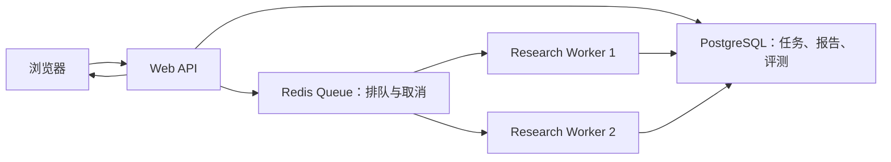

# Render 单容器部署

这条路线使用一个 Render Web Service（可运行后端程序的云服务）承载 Vue 前端、FastAPI 后端和研究进程，对外只有一个 HTTPS 地址。

## 部署前准备

1. 在你自己的 GitHub 账号创建一个新仓库。
2. 把当前本地项目推送到该仓库。不要推送到 Datawhale 原仓库。
3. 准备一个 OpenAI-compatible API 模型服务的 `LLM_MODEL_ID`、`LLM_BASE_URL` 和 `LLM_API_KEY`。
4. 生成一个只用于演示访问的强密码，作为 `APP_ACCESS_PASSWORD`。

## 创建服务

1. 登录 [Render Dashboard](https://dashboard.render.com/)，选择 **New > Blueprint**。
2. 连接你自己的 GitHub 仓库。Render 会读取仓库根目录的 `render.yaml`。
3. 在首次创建时填写标记为 secret 的三个模型变量和访问密码。
4. 确认实例类型为 Free，然后创建 Blueprint。
5. 等待 Docker 构建和健康检查通过，打开 Render 分配的 `https://...onrender.com` 地址。

`render.yaml` 默认选择新加坡区域、DuckDuckGo 检索、每 IP 每小时 5 次、整个服务每日 20 次研究。部署前可按模型成本调整。

`ENABLE_RUN_TELEMETRY=true` 启用运行埋点，记录配置、规划、搜索、总结、报告阶段耗时，以及子任务、搜索失败、降级恢复、LLM 调用和 Token 用量。`PERSIST_RUN_METRICS=true` 会在任务成功、失败或取消后，把单次结果原子写入 `RUN_METRICS_DIR`（默认 `backend/data/run_metrics`）下的 `<run_id>.json`。这些能力不会增加新的 SSE 事件，不执行引用网络检查，也不会改变最终报告。若预发布验收发现埋点相关异常，可把 `ENABLE_RUN_TELEMETRY` 设为 `false`，立即恢复为无记录器的旧行为。

`TOKEN_USAGE_FALLBACK=unavailable` 表示供应商未返回 Token 时明确记为不可获得；只有主动改成 `estimated` 才会使用 `tiktoken`（分词器：把模型输入输出近似切分为 Token）估算。`LLM_STREAM_USAGE=auto` 仅对已知支持该参数的流式接口请求真实 usage。费用不会猜测：只有配置 `MODEL_PRICING_FILE` 且模型名精确匹配时才计算。例如：

```json
{
  "currency": "USD",
  "models": {
    "your-model-name": {
      "input_per_million_tokens": 0.5,
      "output_per_million_tokens": 1.5
    }
  }
}
```

`ENABLE_SOURCE_PROVENANCE=false` 是来源溯源模块的初始安全开关。开启后会为每个任务的搜索结果分配 `T1-S1` 形式的稳定编号，在任务完成事件中增加结论—来源映射，并在最终报告事件中增加溯源复核摘要；不会增加或删除 SSE 事件类型。首次开启必须先在预发布环境做同题 A/B 对照，确认报告完整性和耗时没有明显回归，再考虑用于公开演示。

预发布 A/B 可以在单次 `/research` 或 `/research/stream` 请求中传入 `enable_source_provenance: true|false`。该字段只覆盖当前运行；省略时继续使用部署环境的 `ENABLE_SOURCE_PROVENANCE`，因此旧前端和既有 API 调用保持原行为。

来源追踪 schema `1.3` 还会记录编号—URL 错配、裸编号、重复引用率、最大单一来源占比和需要相关性复核的来源数。相关性规则只添加风险标记，不直接删除搜索结果；总结器和报告器不得让被标记来源单独支撑核心结论。

## 上线验收

- 访问 `/healthz` 返回 `{"status":"ok"}`。
- 未输入密码访问首页时返回 401，并出现浏览器密码框。
- 输入密码后能看到研究主题输入页。
- 无需密码访问 `/readyz`，返回 `status: ready` 且没有缺失的环境变量；Render 也使用该接口阻止配置不完整的版本上线。
- 发起固定题目，能看到规划、来源、阶段总结和最终报告持续出现。
- 点击“取消研究”，前端出现已取消提示，后端日志没有 500。
- 故意使用错误模型名进行一次预发布测试，前端能显示明确失败原因；随后恢复正确配置。
- 检查仓库和构建日志没有打印 API Key。
- 对比升级前后的 SSE 事件类型，确认 Phase A 没有新增、删除或重命名事件。
- 分别验证正常完成、模型错误和用户取消；三种路径的页面行为应与升级前一致。
- 检查三种路径都生成 `<run_id>.json`，且文件中不含 API Key、完整 Prompt、网页正文或最终报告。

## 免费层与费用

Render 官方说明：Free Web Service 可免费用于预览和业余项目，但不应当作生产环境。服务连续 15 分钟无入站流量会休眠，下一次请求重新唤醒可能等待约一分钟；本地文件在重启、重新部署或休眠时会丢失。每个 workspace（Render 工作空间）每月包含 750 个免费实例小时，带宽和构建分钟也受月度额度约束。

因此 JSON 持久化在本地开发和单次预发布验收中是真实可用的证据文件，但 Render Free 的本地盘不是长期存储。需要跨重启保留历史指标时，应把同一个 JSON 数据契约接到 PostgreSQL 或对象存储，不能把当前目录宣传为永久数据库。

参考：

- [Render 免费服务与限制](https://render.com/docs/free)
- [Render Blueprint YAML 规范](https://render.com/docs/blueprint-spec)

即使云主机免费，模型 API 和付费检索 API 仍可能产生费用。项目内的密码、限流和每日预算是第一层保护；还应在模型厂商控制台设置账户级预算或余额上限。

## 为什么现在不加数据库和消息队列

当前目标是得到一个稳定、可访问、能完整跑通的作品集链接。单实例内存状态与这个目标匹配，并且避免在 1～3 天窗口中同时引入数据库迁移、队列监控和 worker 运维。

未来升级建议：



升级触发条件包括：需要保存历史报告、多人同时运行、部署多个实例、任务必须在 Web 进程重启后继续、需要失败重试或后台定时研究。由于当前 API 已经使用 `job_id`，前端协议可以保留，主要重构范围集中在任务状态和执行层。
